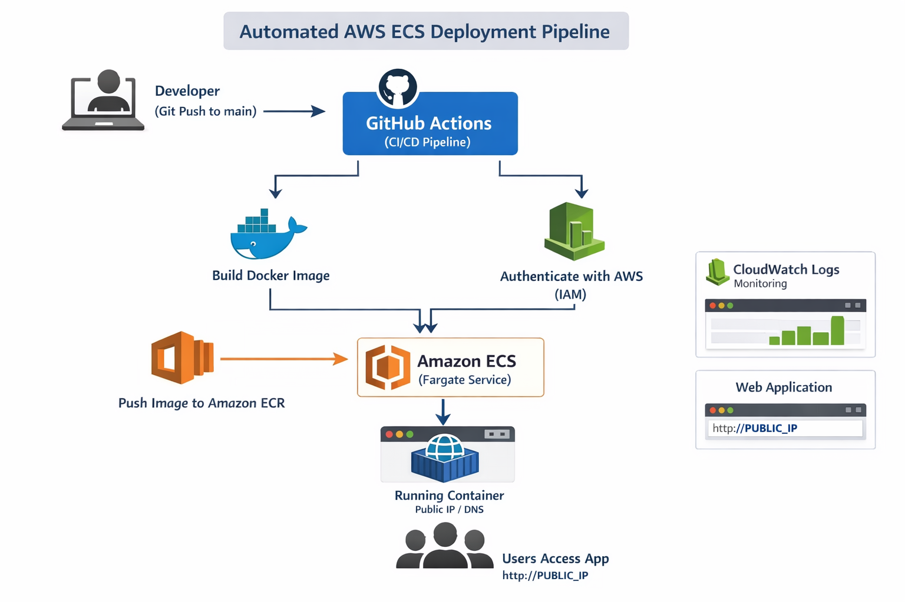

# 🚀 Automated AWS ECS Deployment using Terraform & GitHub Actions

---

##  1. Project Overview

This project implements a complete end-to-end automated deployment pipeline for a containerized Node.js application using:

- Docker (Multi-Stage Build)
- Terraform (Infrastructure as Code)
- AWS ECS (Fargate)
- AWS ECR (Container Registry)
- Amazon S3 (Terraform Remote Backend)
- DynamoDB (State Locking)
- GitHub Actions (CI/CD)
- CloudWatch Logs (Monitoring)

The system automatically builds, pushes, and deploys the application to AWS whenever code is pushed to the `main` branch.

---

##  2. Architecture



### Architecture Flow

1. Developer pushes code to GitHub  
2. GitHub Actions pipeline is triggered  
3. Docker image is built  
4. Image is pushed to Amazon ECR  
5. ECS Service is updated  
6. ECS Fargate pulls latest image  
7. Container runs publicly accessible application  
8. Logs are sent to CloudWatch  

---

##  3. Tech Stack

| Component | Technology |
|------------|------------|
| Application | Node.js + Express |
| Containerization | Docker |
| Infrastructure | Terraform |
| Orchestration | AWS ECS (Fargate) |
| Image Registry | Amazon ECR |
| State Backend | S3 + DynamoDB |
| CI/CD | GitHub Actions |
| Monitoring | CloudWatch |

---

##  4. Project Structure

```
my-ecs-terraform-cicd/
│
├── app/
│   ├── index.js
│   └── package.json
│
├── terraform/
│   ├── main.tf
│   ├── versions.tf
│
├── docs/
│   └── architecture.png
│
├── Dockerfile
├── .gitignore
├── .github/workflows/deploy.yml
└── README.md
```

---

##  5. Application Details

### Endpoints

| Endpoint | Description |
|----------|------------|
| `/` | Returns welcome message |
| `/health` | Returns 200 OK |
| Other routes | Returns 404 Not Found |

---

##  6. Docker Configuration

### Multi-Stage Build Used

Benefits:

- Smaller image size  
- Production dependency optimization  
- Improved security  

### Build Locally

```bash
docker build -t ecs-app .
docker run -p 3000:3000 ecs-app
```

Access locally:

```
http://localhost:3000
http://localhost:3000/health
```

---

##  7. AWS Setup Instructions

### Step 1: Create S3 Bucket (Terraform Backend)

- Go to AWS Console → S3  
- Create bucket  

Example name:

```
lahari-ecs-terraform-state-2026
```

---

### Step 2: Create DynamoDB Table

Table name:

```
terraform-lock-table
```

Partition key:

```
LockID (String)
```

Use **On-Demand capacity mode**.

---

### Step 3: Create IAM User for CI/CD

Create IAM user with:

- Programmatic access  
- Attach policy: `AdministratorAccess` (for learning/demo project)  

Generate:

- Access Key ID  
- Secret Access Key  

---

##  8. Terraform Deployment

### Initialize Terraform

```bash
cd terraform
terraform init
```

Expected output:

```
Terraform has been successfully initialized
```

---

### Plan Infrastructure

```bash
terraform plan
```

---

### Apply Infrastructure

```bash
terraform apply
```

Type:

```
yes
```

Resources Created:

- ECR repository  
- ECS cluster  
- ECS task definition  
- ECS service  
- Security group  
- CloudWatch log group  

---

### Verify Idempotency

```bash
terraform plan
```

Expected:

```
No changes. Infrastructure matches configuration.
```

---

##  9. Manual First Deployment (Initial Image Push)

### Login to ECR

```bash
aws ecr get-login-password --region us-east-1 | \
docker login --username AWS --password-stdin <your-ecr-registry>
```

---

### Tag Image

```bash
docker tag ecs-app:latest <your-ecr-registry>/ecs-app:latest
```

---

### Push Image

```bash
docker push <your-ecr-registry>/ecs-app:latest
```

---

### Force ECS Update

```bash
aws ecs update-service \
  --cluster ecs-app-cluster \
  --service ecs-app \
  --force-new-deployment \
  --region us-east-1
```

---

##  10. CI/CD Pipeline (GitHub Actions)

### Trigger

- On push to `main` branch

### Pipeline Steps

1. Checkout repository  
2. Configure AWS credentials  
3. Login to ECR  
4. Build Docker image  
5. Tag Docker image  
6. Push image to ECR  
7. Update ECS service  

---

### Required GitHub Secrets

Go to:

```
Repository → Settings → Secrets → Actions
```

Add:

| Secret | Value |
|--------|-------|
| AWS_ACCESS_KEY_ID | IAM Access Key |
| AWS_SECRET_ACCESS_KEY | IAM Secret Key |
| AWS_REGION | us-east-1 |
| ECR_REGISTRY | Your ECR registry URL |

---

##  11. Logging & Monitoring

Logs available at:

```
AWS Console → CloudWatch → Log Groups → /ecs/ecs-app
```

---

##  12. Application Access

After deployment:

```
http://<public-dns>
http://<public-dns>/health
```

---

##  13. Testing CI/CD Automation

1. Modify `index.js`  
2. Commit and push:

```bash
git add .
git commit -m "Test auto deployment"
git push
```

3. Wait for GitHub Actions to finish  
4. Refresh browser  
5. Changes should be live  

---

##  14. Destroy Infrastructure (Important)

To avoid AWS charges:

```bash
terraform destroy
```
---

##  Author

Lahari Sri Kotipalli  

